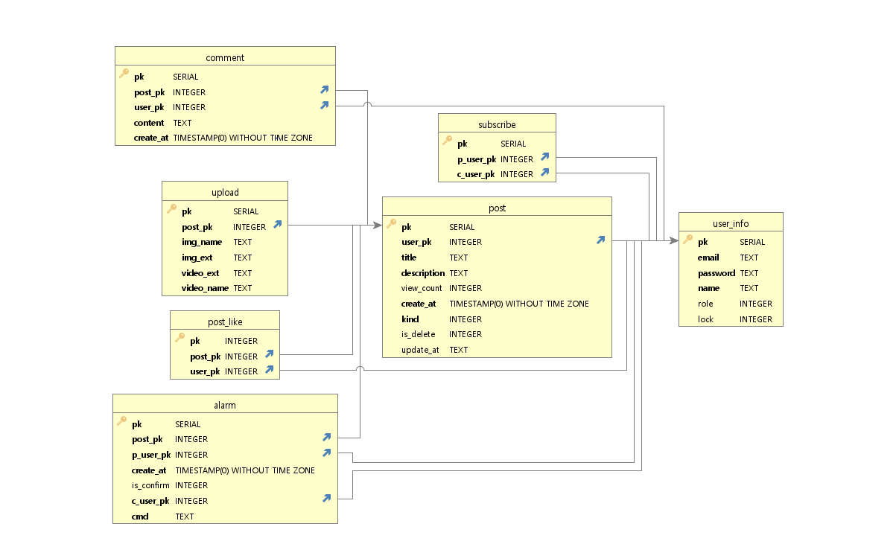

# ✔ Metube - eGovFrame

## :office:동작 화면
* **Login Page**

* **Main Page**

* **Detail Post**

* **Create Post**

## :link: 배포 URL
* ..
* ..

## :clipboard: 개발환경
* Eclipse
* Insomnia
* HeidiSql
* GitHub

## :clipboard: 사용 기술
### 백엔드
#### Spring
* JAVA 8
* Spring MVC
* Spring Mybatis
* Spring AOP

#### Build tool
* Maven

#### Database
* PostgreSQL
* Mybatis

#### AWS
* EC2
* RDS

### 프론트엔드
* Javascript
* JQuery
* Vue

## :clipboard: 주요 키워드
* **REST API**
* **트랜잭션**
* **Lucy-XSS-Servlet-Filter**
* **Git 버전관리**
* **Docker**
* **AWS EC2 배포**
* **DB RDS 배포**

* **Http request range(비디오 스트리밍)**

* **소켓 알림 구현**

* **썸네일 자동생성(크롭)**

* **Bcrypt 비밀번호 암호화**

* **Simple captcha**

* **CKEditor**

* **조회수 반복증가 쿠키로 막기**

## :factory: 시스템 구조

## :link: ERD 설계

## :link: Rest API 문서
* [Metube Rest API 문서](https://github.com/)

기타 메모(접기/펼치기)

subscribe
p_user_pk : parents_user_pk
c_user_pk: child_user_pk

**role**
1 = 게스트
2 = user
3 = admin

**kind**
1 커뮤 게시판
2 자유 게시판 (user, admin)
3 공지 게시판 (admin만)

**is_delete**
0 정상
1 삭제

**lock**
0 정상
1 잠금

