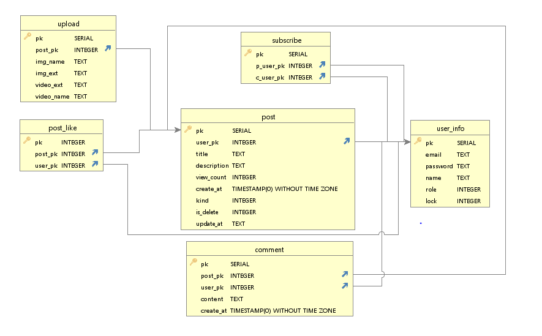

# ✔ Metube - eGovFrame

## :link: 배포 URL
* ..
* ..

## :clipboard: 개발환경
* Eclipse
* Insomnia
* HeidiSql
* GitHub

## :clipboard: 사용 기술
### 백엔드
#### Spring
* JAVA 8
* Spring MVC
* Spring Mybatis
* Spring AOP
* spring 

#### Build tool
* Maven

#### Database
* PostgreSQL
* Mybatis

#### AWS
* EC2
* S3

### 프론트엔드
* Javascript
* Vue

## :clipboard: 주요 키워드
* REST API
* HTTP 통신
* Http request range(비디오 스트리밍)
* Mybatis
* 트랜잭션
* 썸네일 자동생성
* Bcrypt 비밀번호 암호화
* Simple captcha
* Git 버전관리
* AWS EC2 배포

## :factory: 시스템 구조

## :link: ERD 설계

## :link: Rest API 문서
* [Metube Rest API 문서](https://github.com/didrlgus/springboot-shoppingmall/issues/58)
